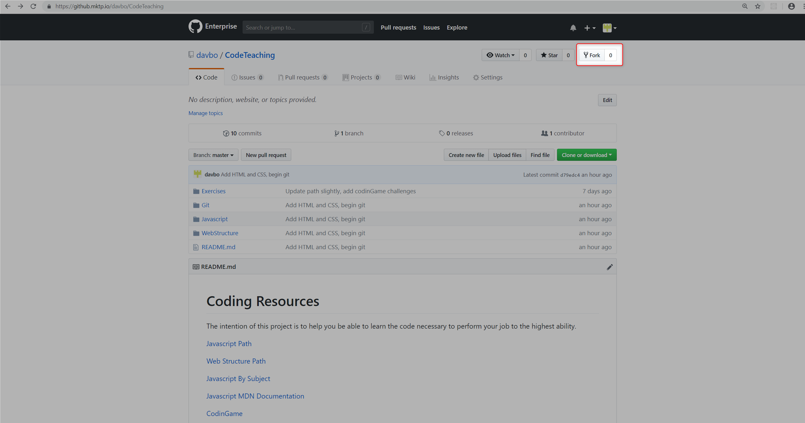
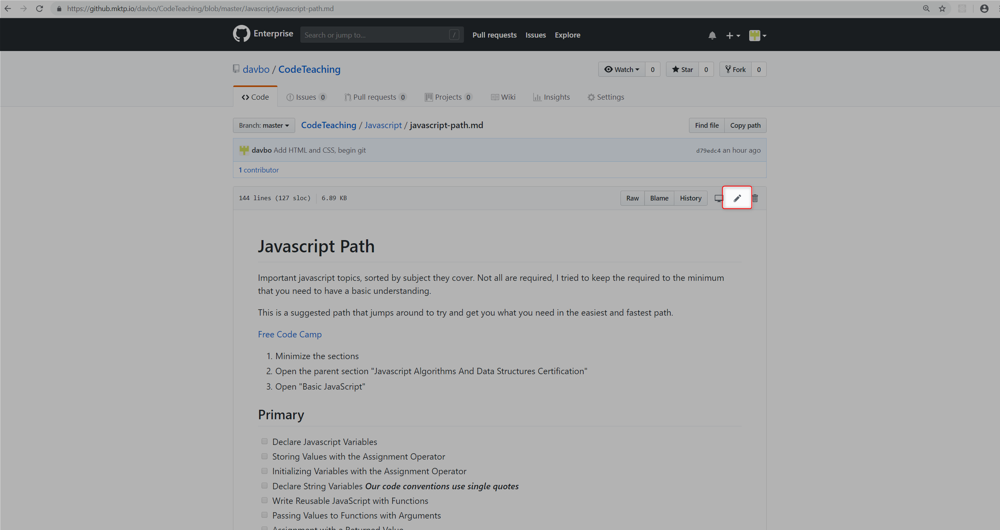
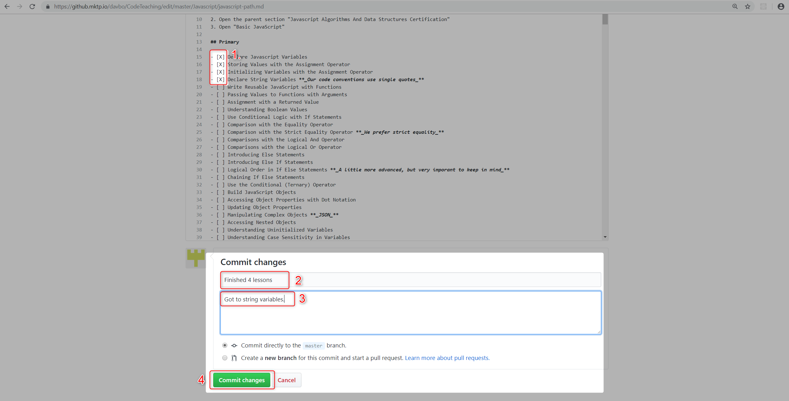

# Gitting Started

To get started with this checklist of resources you can follow these instructions.

1. Fork the repository. This creates an independent copy of the repo that you control. This means you can mark off items without affecting any other user.

2. Decide where to start. Not everyone is at the same level, and so start where it makes sense for you. Feel free to skip around. I will try and list the prerequisites if there are any.

3. After you have completed one or more activities edit the file you worked with.

4. Find the item you finished, and replace the space in between `[]` with a `X` so it looks like `- [X]`. Once saved it will display a checked box. At the bottom write a short message of what you accomplished so you can look back, then commit. In this instance it is okay to commit directly to master.

If you find something missing that you feel would be valuable, create an issue following [these instructions.](./suggestions.md)

- [ ] Get started with the learning project