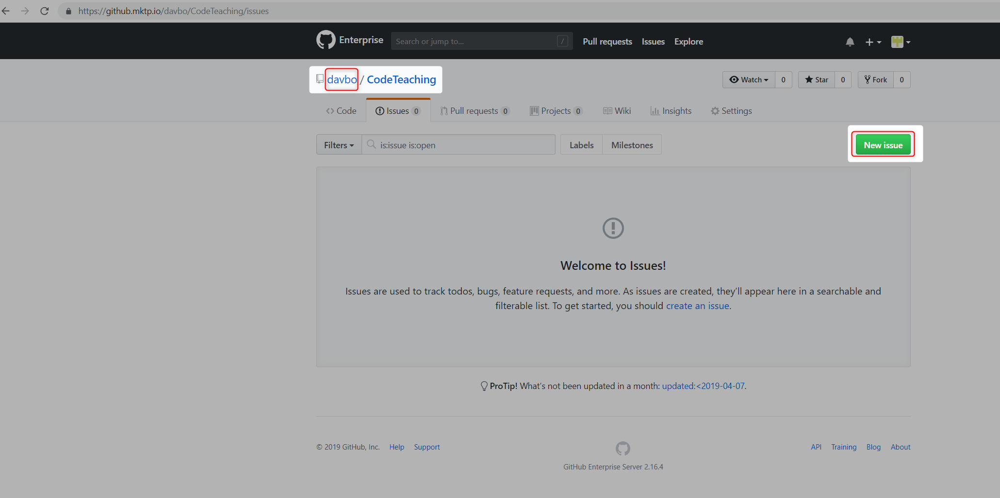

# How to make suggestions

The best way to make a suggestion for something to be added to the checklist is by using Github issues. To do so, make sure that you are on the parent repository, right now in `davbo`. Then click `New issue`. Fill out the information and submit. [Issue Page](/issues)

